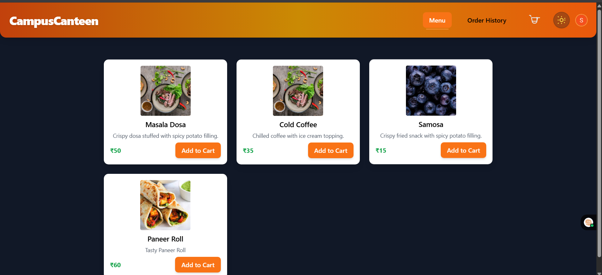

# 🥪 CampusCanteen

A modern, beautiful, and user-friendly food ordering web app for campus canteens.  
Built with **React**, **Tailwind CSS**, and **Clerk** authentication.



---

## 🚀 Features

- **Browse Menu:**  
  View a vibrant, categorized menu with images, prices, and descriptions.

- **Add to Cart & Place Orders:**  
  Seamless cart experience with quantity management and order confirmation.

- **User Authentication:**  
  Secure sign-in/sign-up with Clerk. Only signed-in users can place orders.

- **Order History:**  
  Users can view their own past orders with details and totals.

- **Admin Dashboard:**  
  - View all orders with customer info and phone numbers.
  - See order statistics (total orders, revenue, average order value).
  - Manage menu items (add, edit, delete).

- **Dark/Light Mode:**  
  Toggle between beautiful dark and light themes. Preference is saved.

- **Responsive Design:**  
  Works great on desktop, tablet, and mobile.

---

## 🛠️ Tech Stack

- **Frontend:** React, Tailwind CSS
- **Authentication:** Clerk
- **State & Storage:** React Hooks, localStorage
- **Styling:** Custom Tailwind themes, gradients, and modern UI patterns

---

## 📦 Getting Started

### 1. Clone the repository

```bash
git clone https://github.com/your-username/campus-canteen.git
cd campus-canteen
```

### 2. Install dependencies

```bash
npm install
```

### 3. Set up Clerk

- Create a [Clerk](https://clerk.com/) account.
- Get your **Publishable Key** and add it to a `.env.local` file:

```
VITE_CLERK_PUBLISHABLE_KEY=your_clerk_publishable_key
```

### 4. Start the development server

```bash
npm run dev
```

- Visit [http://localhost:5173](http://localhost:5173) in your browser.

---

## 🧑‍💻 Usage

- **Regular Users:**  
  - Sign in, browse the menu, add items to your cart, and place orders.
  - You'll be prompted for your phone number when placing your first order.
  - View your order history.

- **Admin:**  
  - Log in with the admin email (set in `src/App.jsx`).
  - Access the Admin Dashboard to view all orders and manage the menu.

---

## 🎨 Customization

- **Change Admin Email:**  
  Edit the `ADMIN_EMAIL` constant in `src/App.jsx`.

- **Edit Menu Items:**  
  Use the Admin Dashboard to add, edit, or remove menu items.

- **Styling:**  
  Tweak `src/index.css` and Tailwind config for your own color palette and branding.

---

## 📸 Screenshots

> Add screenshots of the main UI, dark mode, and admin dashboard here!

---

## 🤝 Contributing

Pull requests are welcome! For major changes, please open an issue first to discuss what you'd like to change.

---

## 📄 License

MIT

---

> Made with ❤️ for campus communities.
